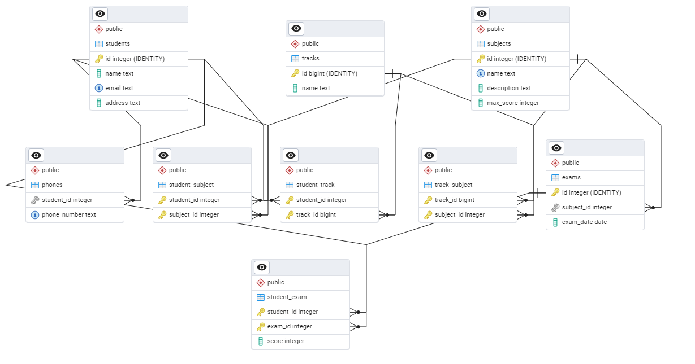

# ITI Grade Management System

## Overview
The **ITI Grade Management System** is a PostgreSQL database designed to manage students, 
their tracks, subjects, exams, and grades. It follows **Normalization principles** 
and implements various database functionalities including transactions, views, indexes, functions, and triggers.

## Database Schema
The database consists of the following tables:

1. **Students**: Stores student details.
2. **Phones**: Stores multiple phone numbers for each student.
3. **Tracks**: Represents different academic tracks.
4. **Subjects**: Stores subject details with maximum scores.
5. **Exams**: Stores exam dates and subjects.
6. **Student_Track**: Many-to-Many relationship between Students and Tracks.
7. **Track_Subject**: Many-to-Many relationship between Tracks and Subjects.
8. **Student_Subject**: Many-to-Many relationship between Students and Subjects.
9. **Student_Exam**: Stores student exam scores.

### Entity-Relationship Diagram (ERD)
  

## Features
- **DDL and Data Insertion** (schema creation and initial data population)
- **Schema Modifications & SELECT Queries**
- **Transactions, Views, Indexes, and New Schema Creation**
- **Stored Functions for Business Logic**
- **Triggers for Automated Actions**
- **Backup, Copy, and Restore Commands**

## Installation & Setup
To run this database, ensure you have PostgreSQL installed.

```sh
psql -U postgres -d iti_grade_management_system -f schema.sql
psql -U postgres -d iti_grade_management_system -f modifications.sql
psql -U postgres -d iti_grade_management_system -f transactions.sql
psql -U postgres -d iti_grade_management_system -f functions.sql
psql -U postgres -d iti_grade_management_system -f triggers.sql
```

## Backup & Restore
To create a backup:
```sh
pg_dump -U postgres -d iti_grade_management_system -F c -f backup.dump
```
To restore from backup:
```sh
pg_restore -U postgres -d iti_grade_management_system -F c -f backup.dump
```

## Repository Structure
```
📂 iti_grade_management_system
│── 📄 schema.sql        # DDL and initial data
│── 📄 modifications.sql # Schema modifications and queries
│── 📄 transactions.sql  # Transactions, Views, Indexes
│── 📄 functions.sql     # Stored functions
│── 📄 triggers.sql      # Triggers and backup commands
│── 📄 README.md         # Project documentation
│── 📄 erd.png           # ERD image
```

## License
This project is licensed under the MIT License.

---

Feel free to modify the content as per your requirements!

